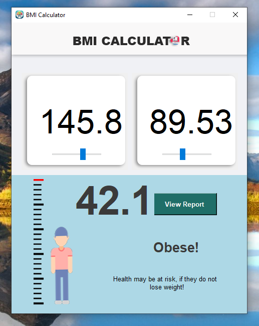

# ⚖️ BMI Calculator App (Python + Tkinter GUI)

A beginner-friendly, interactive **Body Mass Index (BMI)** calculator built using `tkinter`, `Pillow`, and custom image assets. This app allows users to **input height and weight**, calculates BMI in real-time using sliders, and visually adjusts a character image based on height.

---

## 📌 Features

- 📊 **BMI Calculation**: Automatically computes BMI from height (cm) and weight (kg).
- 🧍 **Animated Character Image**: Character position changes based on height selection.
- 🎨 **Custom-Styled UI**: Built with icons, themed backgrounds, and intuitive layout.
- 🎚️ **Sliders for Input**: Smooth sliders for height and weight selection.
- 📋 **Result Display**: Shows BMI value, health category, and helpful tips.

---

## 📂 Project Structure

`38_BMI_Calculator/`  
├── assets/  
│   ├── icon.png  
│   ├── top.png  
│   ├── box.png  
│   ├── scale.png  
│   ├── screenshot.png  
│   └── man.png  
├── main.py  
├── requirements.txt  
└── README.md  

---

## ▶️ How to Run

1. **Install Python 3.7 or higher**
2. **Install dependencies:**

```bash
pip install -r requirements.txt
```
3. **Run the application:**

```bash
python main.py
```

---

## ⚙️ How It Works

1. GUI Setup
    - Uses `tkinter` to create a fixed-size layout with styled images and background.
2. Height & Weight Input
    - Sliders let the user select height and weight, which are synced with text input boxes.
3. BMI Calculation
    - The BMI is computed using the standard formula and shown with status text.
4. Animated Visual
    - The character image moves vertically based on height input, providing visual feedback.

---

## 📦 Dependencies

- `Pillow` – for displaying `.png` icons and backgrounds
- `tkinter` – GUI creation (built-in)

---

## 📸 Screenshot



---

## 📚 What You Learn

- GUI programming with `tkinter`
- Image manipulation using `Pillow`
- Real-time event handling with sliders
- Applying formulas and displaying results dynamically
- Organizing Python GUI projects

---

## 👤 Author

Made with ❤️ by **Shahid Hasan**  
Feel free to connect and collaborate!

---

## 📄 License


This project is licensed under the MIT License – free to use, modify, and distribute.
