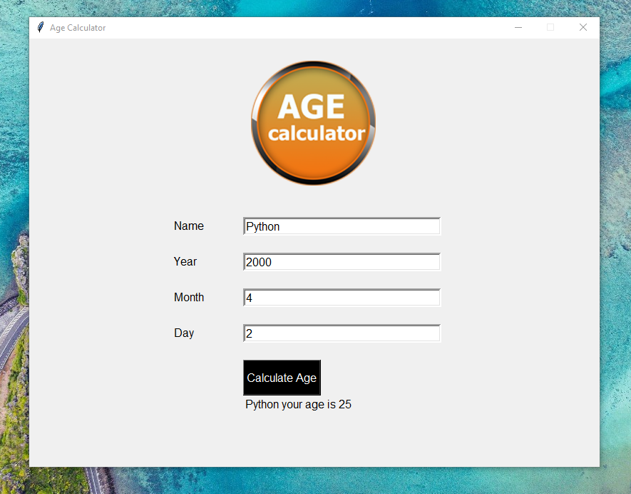

# 🎂 Age Calculator (Python + Tkinter GUI)

A simple GUI application that calculates your exact age based on your birth date.

---

## 📌 Features

- 📅 Date Calculation: Precisely calculates your age in years
- 👤 Personalized Output: Displays your name along with your calculated age
- 🖼️ Visual Appeal: Clean GUI with custom graphics
- ⚡ Instant Results: Calculates age immediately with a single click
- 📱 Responsive Design: Fixed window size for consistent appearance

---

## 📂 Project Structure

```
Age_Calculator_GUI/
├── assets/
│   ├── Age calculator.png
│   └── screenshot.png          
├── main.py        
├── requirements.txt      
└── README.md             
```

---

## ▶️ How to Run
1. Ensure Python 3.10 is installed
2. Run the application:
```bash
python main.py
```
---

## ⚙️ How It Works

1. User Input
Enter your name in the name field
Input your birth date (year, month, day) in the respective fields
2. Calculation
Click the "Calculate Age" button
The app compares your birth date with today's date
Accounts for whether your birthday has already occurred this year
3. Display
Shows personalized message with your name and calculated age
Results appear at the bottom of the window

---

## 📦 Dependencies
- Python 3.10 (includes Tkinter)
- No additional packages required

---

## 📸 Screenshot



---

## 📚 What You Learn

- Basic GUI development with Tkinter
- Date handling and calculations in Python
- Working with entry widgets and buttons
- Simple layout management with pack() and place()
- String formatting for output display

---

## 👤 Author

Made with ❤️ by **Shahid Hasan**  
Feel free to connect and collaborate!

---

## 📄 License

This project is licensed under the MIT License – free to use, modify, and distribute.