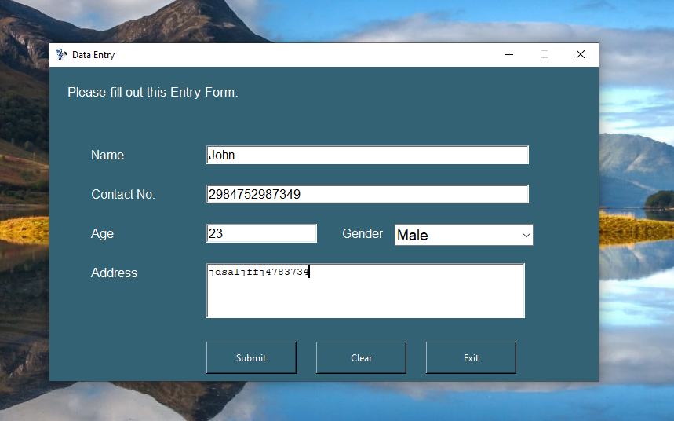

# ✅ Data Entry Form App (Python + Tkinter GUI)

A beginner-friendly Python GUI application to **collect and store user data** into an Excel file using `tkinter` and `openpyxl`. This app allows users to input their **name, contact, age, gender, and address**, and saves it to a structured `.xlsx` file.

---

## 📌 Features

- 📝 **Input Fields**: Collects full name, contact number, age, gender, and address.
- 💾 **Excel Storage**: Automatically creates and updates a structured Excel sheet (`.xlsx`) for all entries.
- 🧹 **Clear Button**: Resets all input fields with one click.
- ❌ **Exit Button**: Gracefully exits the application.
- 🖼️ **Custom Icon**: Uses a custom app icon (`logo.png`) from the `assets` folder.
- ✅ **Pre-built Excel Header**: Automatically adds headers to new Excel files.

---

## 📂 Project Structure

`39_Automated_Data_Entry_Form/`  
├── assets/  
|   ├── screemshot
│   └── logo.png  
├── Backened_data.xlsx  
├── main.py  
├── requirements.txt  
└── README.md  

---

## ▶️ How to Run

1. **Install Python 3.7 or higher**
2. **Install dependencies:**

```bash
pip install -r requirements.txt
```
3. **Run the application:**

```bash
python main.py
```

---

## ⚙️ How It Works

1. GUI Layout
    - Designed using `tkinter` with a fixed window size and custom background color.
2. User Data Collection
    - Collects name, contact, age, gender (via dropdown), and address.
3. Excel File Creation
    - On first run, creates `Backened_data.xlsx` with predefined column headers.
4. Data Saving
    - Appends each form submission as a new row in the Excel file.
5. Reset or Exit
    - The "Clear" button wipes all fields; "Exit" closes the app safely.

---

## 📦 Dependencies

- `openpyxl` – for creating and editing Excel `.xlsx` files
- `tkinter` – GUI creation (built-in)

---

## 📸 Screenshot



---

## 📚 What You Learn

- GUI design with `tkinter`
- Saving structured data using `openpyxl`
- Form handling and validation basics
- File and folder organization for Python GUI projects
- Event-driven programming (buttons and input)

---

## 👤 Author

Made with ❤️ by **Shahid Hasan**  
Feel free to connect and collaborate!

---

## 📄 License

This project is licensed under the MIT License – free to use, modify, and distribute.