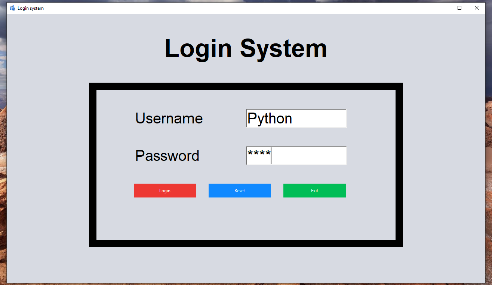
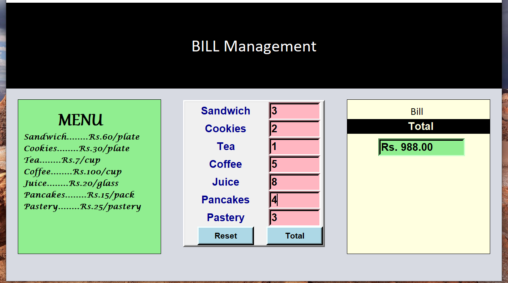

# 🧾 Billing Management System (Python + Tkinter GUI)

A restaurant billing application with login authentication that calculates totals for food items. Built with Python's tkinter for the GUI, it features a secure login system and an itemized billing interface.

---

## 📌 Features

- 🔐 Secure Login: Username/password authentication (default: Python/1234)
- 🍽️ Menu Display: Shows available items with prices in a clean layout
- 🧮 Automatic Calculation: Computes total bill based on item quantities
- 🔄 Reset Function: Clear all quantity fields with one click
- 💵 Formatted Total: Displays total amount in proper currency format

---

## 📂 Project Structure
```
Bill_Management_System_GUI/
├── assets/  
│   ├── login.png         
│   ├── screenshot.png
│   └── screenshot1.png              
├── main.py        
├── requirements.txt      
└── README.md             
```
---

## ▶️ How to Run

1. Make sure Python 3.10 is installed
```bash

python main.py
```

---

## 🖱️ Usage
1. Login Credentials
    - Username: Python
    - Password: 1234
2. Billing Operations
    - Enter quantities for desired items
    - Click "Total" to calculate the bill
    - View total amount in the bottom-right section
    - Use "Reset" to clear all entries

---

## ⚙️ How It Works

1. Login Screen
    - Validates credentials before granting access
    - Provides clear error messages for invalid inputs
2. Billing Interface
    - Displays 7 food items with price per unit
    - Accepts quantity inputs for each item
    - Calculates total cost automatically when clicking "Total"
    - "Reset" button clears all entries
3. Calculation Logic
    - Handles empty/zero quantities gracefully
    - Sums costs for all items
    - Formats output as "Rs. XX.XX"

---

## 📦 Dependencies
`tkinter` (built into Python) - For GUI components
Standard Python libraries (`os`)

---

## 📸 Screenshot




---

## 📚 What You Learn

- Tkinter window management (Toplevel windows)
- Form validation and error handling
- Grid-based GUI layout
- StringVar for dynamic value updates
- Event-driven programming with buttons
- Basic arithmetic operations for billing

---

## 👤 Author

Made with ❤️ by **Shahid Hasan**  
Feel free to connect and collaborate!

---

## 📄 License


This project is licensed under the MIT License – free to use, modify, and distribute.
