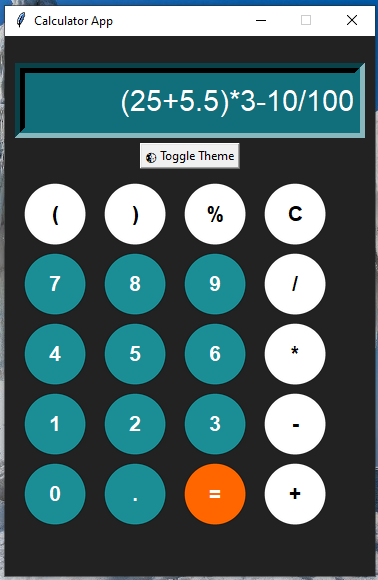

# 🧮 Calculator (Python + Tkinter GUI)

A visually appealing calculator app with circular buttons, hover effects, and theme switching. Built using `tkinter`, `Pillow`, and `simpleeval`, this calculator features a clean design with persistent calculation history.

---

## 📌 Features

- 🔘 **Circular Buttons**: Modern UI with circular buttons that have hover and click effects
- 🌓 **Theme Switching**: Toggle between light and dark modes
- 📜 **Calculation History**: View your last 5 calculations above the display
- 🔢 **Full Functionality**: Supports all basic operations (+, -, *, /) plus parentheses and percentages
- ✨ **Visual Feedback**: Buttons flash when clicked and change color on hover

---
```
Calculator_GUI/
├── assets/
│   └── screenshot.png
├── main.py
├── README.md
└── requirements.txt
```
---

## ▶️ How to Run

1. **Install Python 3.10**
2. **Install dependencies:**

```bash
pip install -r requirements.txt
```
3. **Run the application:**

```bash
python main.py
```

---

## ⚙️ How It Works

1. GUI Setup
    - Uses `tkinter` with custom circular buttons created using `Pillow`
    - Fixed-size window (370×540) with dark mode as default
2. Calculation Engine
    - Uses `simpleeval` for safe expression evaluation
    - Handles percentages by converting them to division by 100
3. Visual Effects
    - Buttons brighten on hover and darken when clicked
    - History displays up to 5 previous calculations
4. Theme System
    - Toggle between light and dark modes with the theme button

---

## 📦 Dependencies

- `Pillow` – for displaying `.png` icons and backgrounds
- `tkinter` – GUI creation (built-in)
- `simpleeval` – for safe expression evaluation

---

## 📸 Screenshot



---

## 📚 What You Learn

- Advanced GUI programming with `tkinter`
- Custom widget creation with `Pillow`
- Event-driven programming with hover/click effects
- Theme switching implementation
- Safe expression evaluation
- Calculation history management
---

## 👤 Author

Made with ❤️ by **Shahid Hasan**  
Feel free to connect and collaborate!

---

## 📄 License


This project is licensed under the MIT License – free to use, modify, and distribute.


