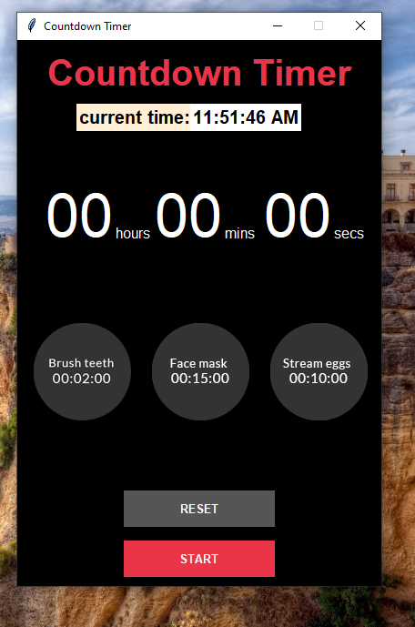

# ⏳ Countdown Timer (Python + Tkinter GUI)

A simple and elegant countdown timer built using Python's Tkinter library. Users can input custom time or use quick-select buttons, start the countdown, and get notified with an alert sound when the time is up.

---

## 📌 Features

- ⌚ **Real-Time Clock**: Displays the current system time at the top.
- 🧮 **Custom Timer Input**: Set hours, minutes, and seconds manually.
- 🔔 **Audio Alert**: Plays an alarm sound (`alarm.mp3`) when the countdown finishes.
- 🎯 **Quick-Set Buttons**: One-click options to auto-fill time for brushing, face wash, or boiling eggs.
- 🖼️ **Image Buttons**: Custom icons for preset tasks using image buttons.
- 🧼 **Reset Functionality**: Quickly reset the timer with one button.
- 🎨 **User-Friendly GUI**: Dark-themed, minimalist interface.

---

## 📂 Project Structure

Countdown_Timer/  
├── assets/  
│   ├── brush.png  
│   ├── face.png  
│   ├── screenshot.png
│   └── eggs.png
├── main.py  
├── requirements.txt  
└── README.md  

---

## ▶️ How to Run

1. **Install Python 3.7+** (make sure it's added to PATH).  
2. **Install dependencies:**

```bash
pip install -r requirements.txt
```
3. **Run the application:**

```bash
python main.py
```

---

## ⚙️ How It Works

1. **GUI Initialization**
    - Tkinter window is styled with dark mode.
2. **Clock Display**
    - Shows live system time using `time.strftime`.
3. **User Input**
    - Manual time input via three entry fields (Hours, Minutes, Seconds).
4. **Timer Logic**
    - Starts countdown and updates every second using `after()`.
    - When finished, plays alarm.mp3 (must exist in the root folder).
5. **Preset Buttons**
    - Brush (2 mins), Face Wash (15 mins), Boil Eggs (10 mins).
    - Triggered via image buttons with .png icons from assets/.
6. **Reset Button**
    - Resets input values and stops the countdown.

---

## 📦 Dependencies

- Python 3.7 or higher
- Tkinter (comes built-in with Python)
- playsound==1.2.2

---

## 📸 Screenshot



---

## 📚 What You Learn

- How to build interactive GUI apps with Tkinter
- Countdown timer logic with real-time updates
- Playing sound files in Python
- Using PhotoImage and custom buttons
- Folder and file handling using os

---

## 👤 Author

Made with ❤️ by **Shahid Hasan**  
Feel free to connect and collaborate!

---

## 📄 License

This project is licensed under the MIT License – free to use, modify, and distribute.