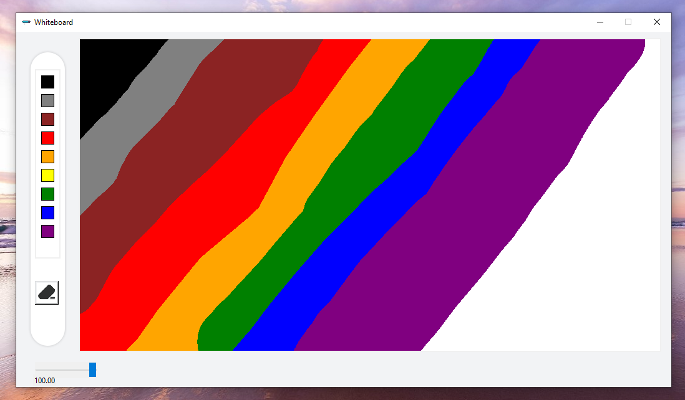

# 🖌️ Digital Whiteboard (Python + Tkinter GUI)

A beginner-friendly and stylish Python GUI app that allows you to draw freely like a digital whiteboard. Built using `tkinter` and `Pillow`, this app provides a customizable pen thickness slider, color palette, and canvas reset button within a clean, fixed layout design.

---

## 📌 Features

- 🎨 **Color Palette**: Choose from a vertical color strip to set your drawing color.
- 🖋️ **Draw Freely**: Click and drag your mouse to draw lines on the canvas.
- 🧽 **Eraser Button**: Clears the entire canvas with one click.
- 📏 **Pen Size Slider**: Adjust the thickness of your drawing line using a live slider.
- 🖼️ **Custom Icons**: Visually enhanced UI with custom buttons and logos.

---

## 📂 Project Structure

`31_Digital_Whiteboard_Basic/`  
├── assets/  
│   ├── logo.png  
│   ├── color section.png  
│   └── eraser.png  
├── main.py  
├── requirements.txt  
└── README.md  

---

## ▶️ How to Run

1. **Install Python 3.7 or higher**
2. **Install dependencies:**

```bash
pip install -r requirements.txt

```
3. **Run the application:**

```bash
python main.py
```

---

## ⚙️ How It Works

1. GUI Setup
    - Creates a fixed-size `Tkinter` window with color selector, slider, and canvas.
2. Drawing Mechanism
    - Uses `Canvas` widget and mouse motion events to create smooth freehand drawing.
3. Color Selection
    - A vertical color palette lets you switch pen color instantly.
4. Pen Thickness
    - Real-time slider updates line width with visual feedback.
5. Eraser
    - Clicking the eraser button clears the canvas and resets the drawing area.

---

## 📦 Dependencies

- `Pillow` – For loading `.png` images as GUI assets
- `tkinter` – Python’s built-in GUI library (no installation needed)

---

## 📸 Screenshot



---

## 📚 What You Learn

- GUI programming with `tkinter`
- Using canvas and drawing with mouse events
- Dynamic sliders and live data binding
- Loading and displaying images using `Pillow`
- Structuring real-world GUI applications

---

## 👤 Author

Made with ❤️ by **Shahid Hasan**  
Feel free to connect and collaborate!

---

## 📄 License

This project is licensed under the MIT License – free to use, modify, and distribute.