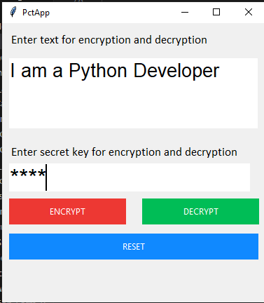

# 🔐 Encryption/Decryption Tool (Python + Tkinter GUI)

A secure message encryption and decryption application that uses base64 encoding. This tool provides a simple interface to protect your messages with password authentication.

---

## 📌 Features

- 🔒 **Message Encryption**: Convert your text into base64 encoded format
- 🔓 **Message Decryption**: Decode base64 messages back to readable text
- 🔑 **Password Protection**: Uses a secret key (password: "1234") for security
- ♻️ **Reset Functionality**: Clear all inputs with one click
- 🖥️ **Clean GUI**: Simple and intuitive interface with color-coded operations

---

## 📂 Project Structure
```
`EncryptionDecryption_Tool_GUI/`  
├── assets/
│   └── screenshot.png  
├── main.py  
└── README.md  
```
---

## ▶️ How to Run

1. **Install Python 3.10**
2. **Run the application:**

```bash
python main.py
```
---

## ⚙️ How It Works

1. Encryption Process
    - Enter your text in the input box
    - Provide the secret key (password: "1234")
    - Click "ENCRYPT" to convert your message to base64 format
    - The encrypted message appears in a new red-themed window
2. Decryption Process
    - Paste a base64 encoded message in the input box
    - Provide the secret key (password: "1234")
    - Click "DECRYPT" to convert it back to readable text
    - The decrypted message appears in a new green-themed window
3. Security Note
    - The app uses a fixed password "1234" (for demonstration)
    - In a production environment, you would implement proper password handling

---

## 📸 Screenshot


---

## 📚 What You Learn

- GUI development with Tkinter
- Base64 encoding/decoding in Python
- Password-protected functionality
- Creating multi-window applications
- Building color-coded interfaces
- Input validation and error handling

---

## 👤 Author

Made with ❤️ by **Shahid Hasan**  
Feel free to connect and collaborate!

---

## 📄 License


This project is licensed under the MIT License – free to use, modify, and distribute.

