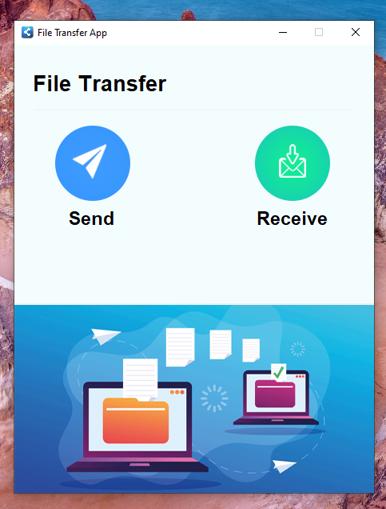

# 📁 File Transfer App (Python + Tkinter GUI)

A beginner-friendly and visually styled Python GUI app that allows you to **send and receive files over a local network** using sockets. Built using `tkinter`, `Pillow`, and Python’s `socket` module, the app features a clean interface with custom graphics and supports all file types.

---

## 📌 Features

- 📤 **Send Files**: Select and send any file to another computer on the same network.
- 📥 **Receive Files**: Receive files from a sender after entering their host ID.
- 📂 **Save Location Selection**: Choose where to save received files.
- 🖼️ **Custom GUI**: Styled interface with images and icons for a professional look.
- 🔒 **Local Network Transfer**: Uses socket programming for peer-to-peer file transmission.

---

## 📂 Project Structure

`33_File_Transfer_App/`  
├── assets/  
│   ├── background.png  
│   ├── send.png  
│   ├── receive.png  
│   ├── sender.png  
│   ├── receiver.png  
│   ├── id.png  
│   ├── profile.png  
│   ├── arrow.png  
│   └── icon.png  
├── main.py  
├── requirements.txt  
└── README.md  

---

## ▶️ How to Run

1. **Install Python 3.7 or higher**
2. **Install dependencies:**

```bash
pip install -r requirements.txt
```
3. **Run the application:**

```bash
python main.py
```

---

## ⚙️ How It Works

1. GUI Setup
    - Built with `tkinter` and styled using `Pillow`-based image assets.
2. File Sending
    - Opens a socket server, waits for incoming connection, and sends the selected file in binary chunks.
3. File Receiving
    - Connects to sender’s IP address, receives filename and data, then writes the file to chosen location.
4. Local Network Use
    - Works best when both systems are on the same Wi-Fi or LAN network.

---

## 📦 Dependencies

- `Pillow` – for displaying `.png` icons and backgrounds
- `tkinter` – GUI creation (built-in)
- `socket` – Networking for file transfer (built-in)

---

## 📸 Screenshot



---

## 📚 What You Learn

- GUI programming with  `tkinter`
- Basic socket programming for local file transfer
- File dialogs and message boxes
- Structuring real-world Python GUI applications
- Safe file handling and save prompts

---

## 👤 Author

Made with ❤️ by **Shahid Hasan**  
Feel free to connect and collaborate!

---

## 📄 License

This project is licensed under the MIT License – free to use, modify, and distribute.