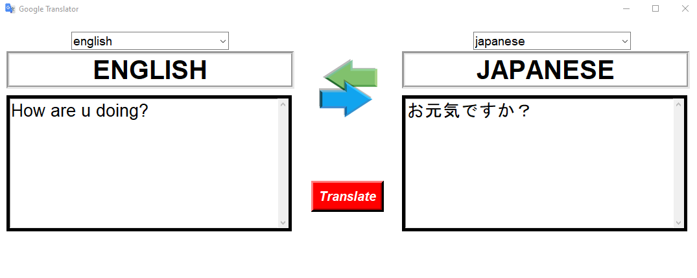

# 🌍 Google Translator (Python + Tkinter GUI)

A Python GUI application that translates text between multiple languages using Google's translation service. Built with `tkinter`, `Pillow`, and the `deep-translator` library, this app provides a clean interface for quick text translation with language auto-detection.

---

## 📌 Features

- 🔄 Multi-language Support: Translate between 100+ supported languages
- 🔍 Auto-Detect Language: Automatically detects source language when set to "auto"
- 📜 Text Wrapping: Handles long text with scrollable text areas
- 🖼️ Visual Interface: Clean layout with Google-inspired icons
- ⚡ Real-time Language Display: Shows currently selected languages above text boxes

---

## 📂 Project Structure
```
Google_Translator_GUI/
├── main.py
├── README.md
├── requirements.txt
└── assets/
    ├── google.png
    ├── arrows.png
    └── screenshot.png
```
---

## ▶️ How to Run

1. **Install Python 3.10**
2. **Install dependencies:**

```bash
pip install -r requirements.txt
```

3. **Run the application:**

```bash
python main.py
```

---

## ⚙️ How It Works

1. GUI Setup
    - Uses `tkinter` to create a fixed-size (1080x400) layout with image styling
2. Translation Process
    - Gets input text and selected languages from comboboxes
    - Uses `GoogleTranslator` for accurate translations
3. Error Handling
    - Shows user-friendly messages for empty input or API errors
4. Dynamic Updates
    - Continuously updates language labels using `.after()` method

---

## 📦 Dependencies

- `Pillow` – for displaying `.png` icons and images
- `deep-translator` – Google Translate API wrapper
- `tkinter` – GUI creation (built-in)

---

## 📸 Screenshot



---

## 📚 What You Learn

- Advanced GUI programming with `tkinter`
- Working with third-party translation APIs
- Implementing scrollable text widgets
- Dynamic UI updates with `.after()`
- Error handling in GUI applications
- Packaging image assets with Python apps

---

## 👤 Author

Made with ❤️ by **Shahid Hasan**  
Feel free to connect and collaborate!

---

## 📄 License


This project is licensed under the MIT License – free to use, modify, and distribute.

