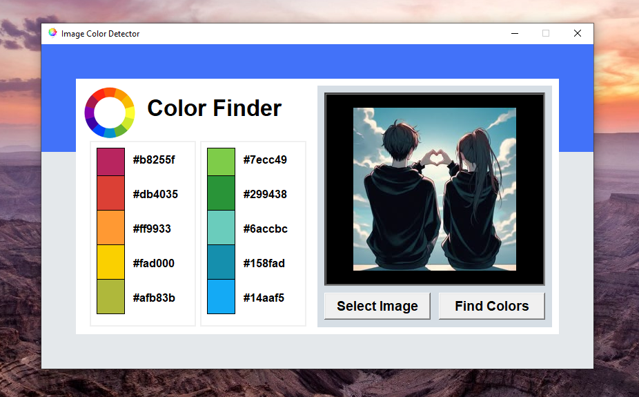

# 🎨 Image Color Detector (Python + Tkinter GUI)

A beginner-friendly and visually styled Python GUI app that detects and displays the **top 10 dominant colors** in any image using the **ColorThief algorithm**. Built using `tkinter`, `Pillow`, and `colorthief`, the app supports `.png` and `.jpg` images and shows color swatches with their corresponding hex codes.

---

## 📌 Features

- 🖼️ **Select Image**: Load `.jpg` or `.png` files from your computer.
- 🎯 **Find Colors**: Extract and display the 10 most dominant colors from the selected image.
- 🎨 **Live Preview**: View all colors as rectangles with their hex codes.
- 💡 **Auto Palette Generation**: Uses `ColorThief` to detect the most prominent color palette.
- 🧑‍🎨 **Styled Interface**: Custom GUI layout with logo, color blocks, and labels.

---

## 📂 Project Structure

`36_Image_Color_Detector/`  
├── assets/  
│   ├── icon.png  
│   └── logo.png  
├── main.py  
├── requirements.txt  
└── README.md  

---

## ▶️ How to Run

1. **Install Python 3.7 or higher**
2. **Install dependencies:**

```bash
pip install -r requirements.txt
```
3. **Run the application:**

```bash
python main.py
```

---

## ⚙️ How It Works

1. GUI Setup
    - Uses `tkinter` to create a clean, fixed-size GUI.
2. Image Selection
    - Uses `filedialog` to select image from local files.
3. Color Extraction
    - `colorthief` analyzes the image and returns the top 10 colors.
4. Display Colors
    - Updates the canvas with colored rectangles and shows corresponding hex codes.

---

## 📦 Dependencies

- `Pillow` – for displaying `.png` icons and backgrounds
- `tkinter` – GUI creation (built-in)
- `colorthief` – for color palette extraction

---

## 📸 Screenshot



---

## 📚 What You Learn

- GUI design with `tkinter`
- Color extraction using the `colorthief` library
- Working with hex and RGB color conversions
- Image handling with `Pillow`
- Organizing Python GUI applications

---

## 👤 Author

Made with ❤️ by **Shahid Hasan**  
Feel free to connect and collaborate!

---

## 📄 License

This project is licensed under the MIT License – free to use, modify, and distribute.