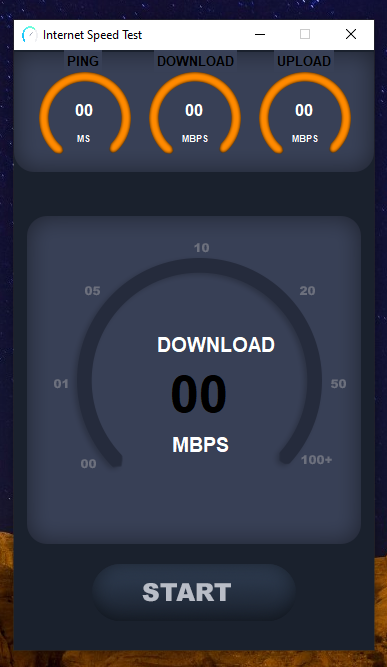

# 🌐 Internet Speed Test (Python + Tkinter GUI)

A professional internet speed testing application built using Python’s `tkinter` GUI library and the `speedtest-cli` module. This tool allows users to measure download speed, upload speed, and ping with a clean and modern graphical interface.

---

## 📌 Features

- 📥 **Download Speed**: Displays real-time download speed in Mbps.
- 📤 **Upload Speed**: Measures upload speed in Mbps.
- 📶 **Ping Test**: Shows network latency in milliseconds.
- 🖼️ **Custom GUI**: Built with high-quality assets for a modern appearance.
- 🖱️ **Single Click Testing**: Run all speed tests with just one button.
- 🔁 **Automatic Server Selection**: Finds the best test server near your location.

---

## 📂 Project Structure

`Internet_Speed_Test/`
```
├── assets/  
│   ├── logo.png  
│   ├── top.png  
│   ├── main.png
│   ├── screenshot.png  
│   └── button.png  
├── main.py  
├── requirements.txt  
└── README.md  
```
---

## ▶️ How to Run

1. **Install Python 3.7 or higher** (make sure Python is added to your system PATH).
2. **Install dependencies** by running:

```bash
pip install -r requirements.txt

```
3. **Run the application:**

```bash
python main.py
```

---

## ⚙️ How It Works

1. Tkinter GUI Setup
Initializes a fixed-size GUI with custom background and labels.
2. Image Asset Loading
Loads GUI components (top image, main image, button) from the `assets/` folder.
3. Speedtest Logic
Uses the `speedtest-cli` module to perform internet speed tests.
Calculates and updates download, upload, and ping values on the screen.
4. Result Display
Automatically updates the corresponding labels in the interface.

---

## 📦 Dependencies

- Python 3.7+
- `speedtest-cli` – for measuring internet speed
- `tkinter` – for GUI (built-in with Python)

---

## 📸 Screenshot



---

## 📚 What You Learn

- GUI development using Tkinter
- Using external APIs and modules (speedtest)
- Dynamically updating GUI labels
- Organizing assets and file paths with `os.path`
- Building clean, user-friendly desktop apps


---

## 👤 Author

Made with ❤️ by **Shahid Hasan**  
Feel free to connect and collaborate!

---

## 📄 License


This project is licensed under the MIT License – free to use, modify, and distribute.
