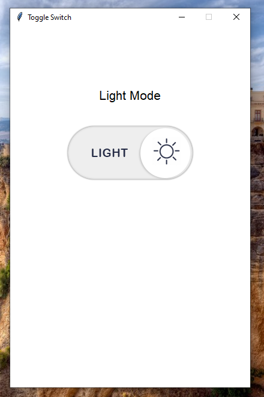

# 🌗 Theme Toggle Switch (Python + Tkinter GUI)

A sleek and simple theme switcher built with Python's Tkinter library. Users can toggle between Light and Dark mode using a visual button, with the interface instantly updating to reflect the selected theme.

---

## 📌 Features

- 🌞 **Light Mode / Dark Mode**: Toggle between two visual themes with a single click.
- 🖼️ **Custom Icons**: Uses image buttons (`light.png`, `dark.png`) to visually represent each mode.
- 🧠 **Smart Theme Logic**: Remembers and switches modes accurately with each toggle.
- 🎨 **Clean GUI**: Minimalist design with centered layout and adaptive colors.
- ⚙️ **No External Libraries**: Fully functional using only built-in Python modules.

---

## 📂 Project Structure
```
24_Theme_Toggle_Switch/  
├── assets/  
│   ├── light.png  
│   ├── dark.png  
│   └── screenshot.png
├── main.py  
├── requirements.txt  
└── README.md  
```
---

## ▶️ How to Run

1. **Install Python 3.7 or higher** (ensure it's added to PATH).  
2. **Install dependencies:** *(none required)*  
3. **Run the application:**

```bash
python main.py
```

---

## ⚙️ How It Works

1. GUI Initialization
    - A Tkinter window is created with a default light background.
2. Image Loading
    - `light.png` and `dark.png` are loaded from the `assets/` directory using `PhotoImage`.
3. Toggle Button
    - Clicking the button switches the interface between light and dark themes.
4. Theme State
    - Maintains current state using a boolean (`button_mode`) to determine which theme is active.
5. Dynamic Updates
    - Background color, text, and image icon change instantly upon toggling.

---

## 📦 Dependencies

- Python 3.7 or higher
- Tkinter (pre-installed with standard Python distributions)

---

## 📸 Screenshot



---

## 📚 What You Learn

- How to design GUI interfaces using Tkinter
- Implementing dark/light mode in Python apps
- Working with PhotoImage for PNG icons
- File and directory handling with os.path
- Toggling state using boolean logic

---

## 👤 Author

Made with ❤️ by **Shahid Hasan**  
Feel free to connect and collaborate!

---

## 📄 License


This project is licensed under the MIT License – free to use, modify, and distribute.
