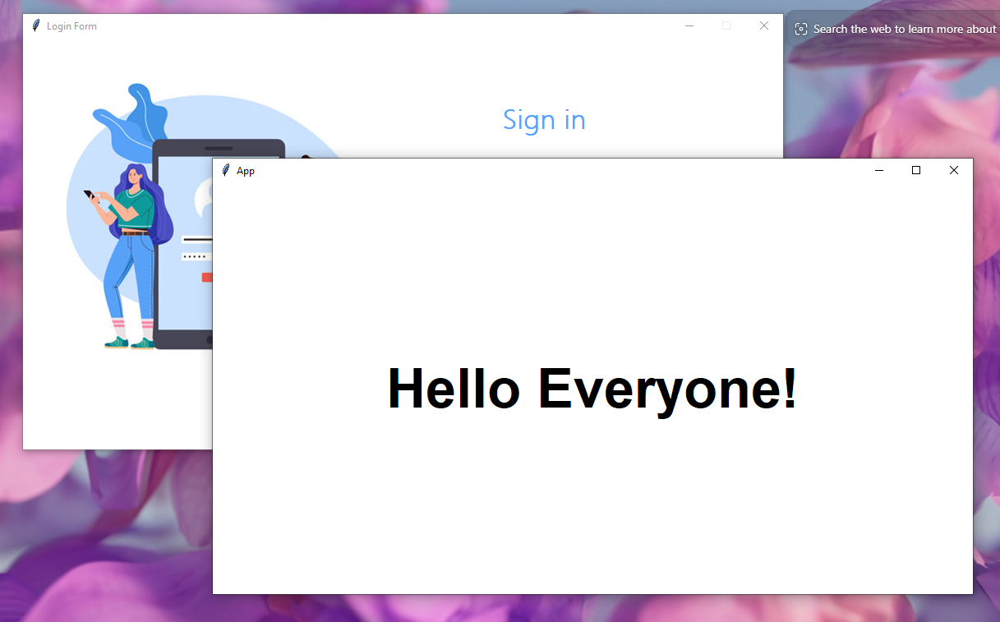

# 🔐 Login & Signup App (Python + Tkinter GUI)

A beginner-friendly and visually styled Python GUI app for user authentication. This app lets users **Sign Up** and **Sign In** using a smooth interface, storing credentials securely in a local file (`datasheet.txt`) using Python’s `ast` module for dictionary handling. Built with `tkinter`, it includes dynamic placeholder behavior and custom graphics.

---

## 📌 Features

- 👤 **Sign Up**: Create a new account with password confirmation.
- 🔑 **Login**: Secure sign-in with validation against stored credentials.
- 🧠 **Smart Fields**: Entry fields with dynamic placeholders (`Username`, `Password`, etc.).
- 📁 **File-based Storage**: Credentials saved in `datasheet.txt` using dictionary format.
- 🎨 **Custom GUI**: Clean white-themed interface with image-based UI using `.png` assets.

---

## 📂 Project Structure

`32_Login_Signup_App/`  
├── assets/  
│   ├── login.png  
│   └── signup.png  
├── datasheet.txt  
├── main.py  
├── requirements.txt  
└── README.md  

---

## ▶️ How to Run

1. **Install Python 3.7 or higher**
2. **Install dependencies:**

```bash
pip install -r requirements.txt

```
3. **Run the application:**

```bash
python main.py
```

---

## ⚙️ How It Works

1. Sign In Logic
Reads `datasheet.txt` into a dictionary using `ast.literal_eval`.
Validates entered username and password.
2. Sign Up Logic
Checks if both passwords match.
Updates `datasheet.txt` with new user credentials.
3. GUI Behavior
Uses `PhotoImage` for branding.
Entry fields switch text on focus using `FocusIn` and `FocusOut` events.
4. File Handling
Automatically creates `datasheet.txt` if not present.
Stores data securely in dictionary format (`{username: password}`).

---

## 📦 Dependencies

- `tkinter` – Python’s built-in GUI library
- `Pillow` – image support (recommended for robust `.png` handling)
- `ast` – safely parses stored user credentials
- `os` – handles file paths dynamically

---

## 📸 Screenshot



---

## 📚 What You Learn

GUI programming with `tkinter`
Working with placeholder logic in entry widgets
Saving user credentials using local file storage
Handling user authentication logic
Structuring Python projects with GUI and assets

---

## 👤 Author

Made with ❤️ by **Shahid Hasan**  
Feel free to connect and collaborate!

---

## 📄 License

This project is licensed under the MIT License – free to use, modify, and distribute.