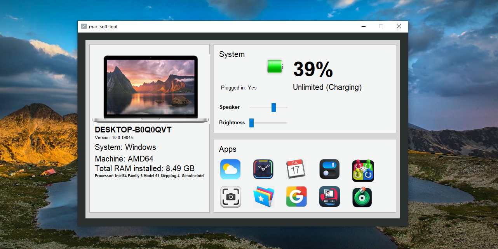

# 🖥️ Mac_Soft_Tool (Python + Tkinter GUI)

A comprehensive system utility application that provides **system monitoring, weather information, brightness/volume control, and quick access to apps**. Built using `tkinter`, `psutil`, `pycaw`, and various APIs, this tool offers a macOS-inspired interface for Windows/Linux systems.

---

## 📌 Features

- 💻 **System Monitoring**: View detailed system info (OS, RAM, processor, battery status)
- ☀️ **Brightness Control**: Adjust screen brightness directly from the app
- 🔊 **Volume Control**: Change system volume with a slider
- ⏰ **Clock & Calendar**: Digital clock and interactive calendar
- ⛅ **Weather App**: Get real-time weather data for any city
- 🎲 **Mini Games**: Simple Ludo dice game
- 🖼️ **Screenshot Tool**: Capture and save screenshots
- 🚀 **Quick App Launcher**: One-click access to Chrome, File Explorer, and more
- 🌙 **Dark/Light Mode**: Toggle between themes

---

## 📂 Project Structure

`mac-soft_Tool/`  
├── assets/  
│   ├── icon.png  
│   ├── laptop.png  
│   ├── battery.png  
│   ├── charging.png  
│   ├── App1.png (Weather)  
│   ├── App2.png (Clock)  
│   └── ... (other app icons)  
├── main.py  
├── requirements.txt  
└── README.md  

---

## ▶️ How to Run

1. **Install Python 3.10**
2. **Install dependencies:**

```bash
pip install -r requirements.txt
```

3. **Run the application:**

```bash
python main.py
```

---

## ⚙️ How It Works

1. System Monitoring
    - Uses `psutil` and `platform` modules to display real-time system information
    - Battery status updates every second
2. Hardware Control
    - `screen_brightness_control` for brightness adjustment
    - `pycaw` for system volume control
3. Weather App
    - Uses OpenWeatherMap API with geolocation
    - Displays temperature, humidity, wind speed, etc.
4. Utilities
    - `pyautogui` for screenshot functionality
    - `webbrowser` integration for quick app launches

## 📦 Dependencies

- `tkinter` – GUI framework
- `Pillow` – Image processing
- `psutil` – System monitoring
- `pycaw` – Audio control
- `screen_brightness_control` – Brightness adjustment
- `pyautogui` – Screenshot functionality
- `geopy`, `timezonefinder`, `pytz` – Weather app components
- `requests` – API calls

---

## 📸 Screenshot



---

## 📚 What You Learn

- Advanced GUI development with `tkinter`
- System-level hardware control in Python
- API integration with OpenWeatherMap
- Real-time data display and updates
- Multi-window application design
- Dark/light mode theming
- System utility development

---

## 👤 Author

Made with ❤️ by **Shahid Hasan**  
Feel free to connect and collaborate!

---

## 📄 License


This project is licensed under the MIT License – free to use, modify, and distribute.
