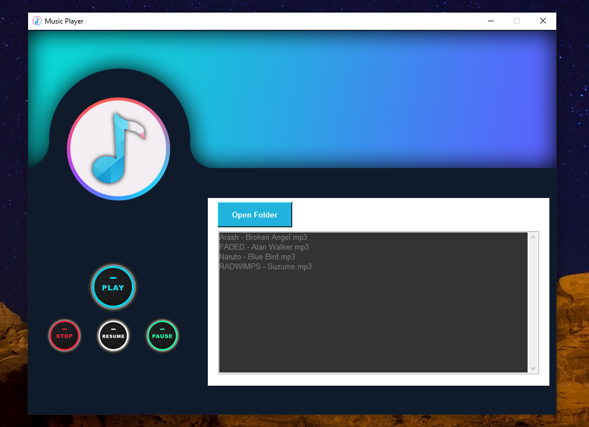

# 🎵 Music Player App (Python + Tkinter GUI)

A stylish and responsive music player built using Python's `tkinter` and `pygame`. This application lets users browse folders, select `.mp3` songs, and control playback through an intuitive GUI interface with custom icons and branding.

---

## 📌 Features

- 📂 **Open Folder**: Browse and load all `.mp3` files from a selected folder.
- 🎶 **Play Music**: Select and play songs directly from the playlist.
- ⏸️ **Pause / Resume / Stop**: Full control over audio playback.
- 📋 **Song List Display**: Scrollable playlist frame for loaded songs.
- 🎨 **Custom GUI**: Clean layout with modern images and buttons.

---

## 📂 Project Structure

`28_Music_Player/`  
├── assets/  
│   ├── logo.png  
│   ├── top.png  
│   ├── play.png  
│   ├── pause.png  
│   ├── stop.png  
│   ├── resume.png
│   ├── screenshot.png
│   └── menu.png 
├── Music/
│   ├── Arash - Broken Angel.mp3
│   ├── FADED - Alan Walker.mp3 
│   ├── Naruto - Blue Bird.mp3
│   └── RADWIMPS - Suzume.mp3
├── main.py  
├── requirements.txt  
└── README.md  

---

## ▶️ How to Run

1. **Install Python 3.7 or higher**  
2. **Install dependencies** by running:

```bash
pip install -r requirements.txt

```
3. **Run the application:**

```bash
python main.py
```

---

## ⚙️ How It Works

1. Tkinter GUI Setup
    - A fixed-size, non-resizable window is created with a dark-themed background.
2. Folder Selection
    - Users choose a folder, and `.mp3` files are automatically loaded into the playlist.
3. Playback Controls
    - `pygame.mixer` handles audio play, pause, stop, and resume commands.
4. Playlist & UI
    - A stylized Listbox displays all songs with scrollbar support and custom play/pause icons.

---

## 📦 Dependencies

- Python 3.7 or higher
- `pygame` – for music playback
- `tkinter` – built-in Python GUI module

---

## 📸 Screenshot



---

## 📚 What You Learn

- GUI development with `tkinter`
- Audio playback using `pygame`
- Handling file dialogs and folder selection
- Scrollable widgets with `Listbox` and `Scrollbar`
- Managing external image assets in GUI apps

---

## 👤 Author

Made with ❤️ by **Shahid Hasan**  
Feel free to connect and collaborate!

---

## 📄 License

This project is licensed under the MIT License – free to use, modify, and distribute.