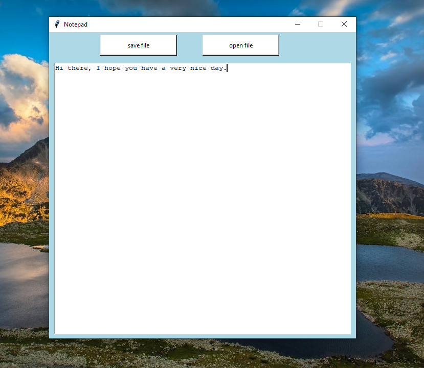

# 📝 Simple Notepad App (Python + Tkinter GUI)

A lightweight notepad application that allows you to **create, open, and save text files** with a clean interface. Built using Python's `tkinter` for the GUI and basic file handling operations.

---

## 📌 Features

- 📂 **Open Files**: Browse and open existing `.txt` files with a single click.
- 💾 **Save Files**: Save your text content with automatic `.txt` extension.
- ✏️ **Text Editing**: Simple text area with word wrapping for comfortable writing.
- 🎨 **Clean Interface**: Light blue themed GUI with fixed window size.

---

## ▶️ How to Run

1. **Ensure Python 3.10 is installed**
2. **Run the application:**

```bash
python main.py

```
---

## ⚙️ How It Works

1. GUI Setup
    - Uses tkinter to create a 600x600 window with a light blue background
2. File Operations
    - Save: Opens a file dialog to save text content with .txt extension
    - Open: Lets you browse and load existing .txt files
3. Text Editing
    - Provides a spacious text area with word wrapping enabled

---

## 📦 Dependencies

- `tkinter` – GUI creation (built-in with Python)

---

## 📸 Screenshot



---

## 🖥️ UI Components

- Two buttons (Save File, Open File)
- Large text area for content editing
- Fixed window size (600x600)
- Light blue background theme

---

## 📚 What You Learn

- Basic GUI programming with `tkinter`
- File handling operations (open/save)
- Creating functional buttons with commands
- Designing simple interfaces with Tkinter

---

## 👤 Author

Made with ❤️ by **Shahid Hasan**  
Feel free to connect and collaborate!

---

## 📄 License


This project is licensed under the MIT License – free to use, modify, and distribute.
