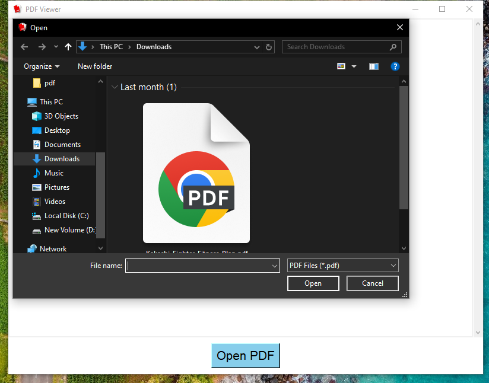

# PDF Viewer App 🖹  

A Python desktop application built with **Tkinter** that allows users to open and view PDF files. Converts PDF pages into images using `pdf2image` and displays them with vertical scrolling.  

---

## ✨ Features  
- Open and view multi-page PDF files  
- Convert PDF pages to images for accurate rendering  
- Scrollable vertical view  
- Auto-resize pages to fit the window  
- Custom app icon  

---

## 📂 Project Structure 
``` 
PDF_Viewer_App_GUI/
├── assets/
│   ├── screenshot.png
│   └── pdf_viewer_icon.png
├── build/
├── dist/
│   └── main.exe
├── pdfviewer.ico
├── main.py
├── requirements.txt
└── README.md
```

---

## ⚙️ Installation  

### 📦 Dependencies  
- Python 3.10  
- `pdf2image==1.16.3`  
- `Pillow==10.1.0`  
- `tkinter` (included in Python standard library)  

### 🔧 Setup  
1. **Install Poppler** (Required for PDF-to-image conversion):  
   - **Windows**:  
     - Download [Poppler for Windows](https://poppler.freedesktop.org/)  
     - Add `poppler/bin` to your **PATH**  
   - **Mac**:  
     ```bash
     brew install poppler
     ```  
   - **Linux (Debian/Ubuntu)**:  
     ```bash
     sudo apt-get install poppler-utils libpoppler-cpp-dev
     ```  

2. **Install Python dependencies**:  
   ```bash
   pip install -r requirements.txt
   ```
3. **Run the app**:
   ```bash
   python main.py
   ```
---

## 📸 Screenshot



---

## 🧊 Convert to EXE (Optional)
First install PyInstaller:

```bash
pip install pyinstaller
```
Then run:

```bash
pyinstaller --onefile --windowed --icon=pdfviewer.ico --add-data "pdfviewer.ico;." main.py
```
> **Note:** The executable will be created in the `dist` folder.

---

## ⚠️ Troubleshooting
Windows: 
```bash
set PATH=%PATH%;C:\path\to\poppler\bin
```
Linux: Additional requirement:

```bash
sudo apt-get install libpoppler-cpp-dev
```
For rendering issues: Try different PDF files

## 👤 Author

Made with ❤️ by **Shahid Hasan**  
Feel free to connect and collaborate!

---

## 📄 License
MIT License
This project is licensed under the MIT License – free to use, modify, and distribute.