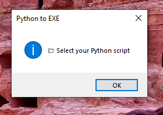

# Python-to-EXE Converter 🐍➡️🖥️

A GUI tool to convert Python scripts (.py) into standalone Windows executables (.exe) with support for custom icons and bundled folders.

---

## 📌 Features

- 📄 Convert `.py` files to single `.exe` (using PyInstaller)
- 🗂️ Automatically detect and bundle referenced folders
- 🖼️ Add custom icons (supports .png, .jpg, .ico)
- 📦 Simple GUI built with `tkinter`
- 📋 **Error Handling**: User-friendly alerts for missing files or failed builds.

---

## 📂 Project Structure
```
PY_to_EXE_Tool/  
├── assets/
│   └── screenshot.png
├── main.py  
├── requirements.txt  
└── README.md  
```
---

## ▶️ How to Run

1. **Install Python 3.7+** (make sure it's added to PATH).  
2. **Install PyInstaller** (if not already):

```bash
pip install -r requirements.txt
```
3. **Run the application:**

```bash
python main.py
```

---

## ⚙️ How It Works

1. Script Selection.
2. Icon Support.
3. Folder Inclusion.
4. Conversion.

---

## 📦 Dependencies

- Install Python 3.7 or higher (ensure it's added to your system PATH during installation)
- PyInstaller
- Pillow (for image conversion).

---

## 📸 Screenshot



---

## 📚 What You Learn

- Tkinter file/folder dialog usage
- Regular expressions for file/folder extraction
- Running shell commands with subprocess
- Image conversion to .ico using Pillow
- Packaging Python projects with PyInstaller
- Designing user-friendly Python utilities

---

## 👤 Author

Made with ❤️ by **Shahid Hasan**  
Feel free to connect and collaborate!

---

## 📄 License

This project is licensed under the MIT License – free to use, modify, and distribute.