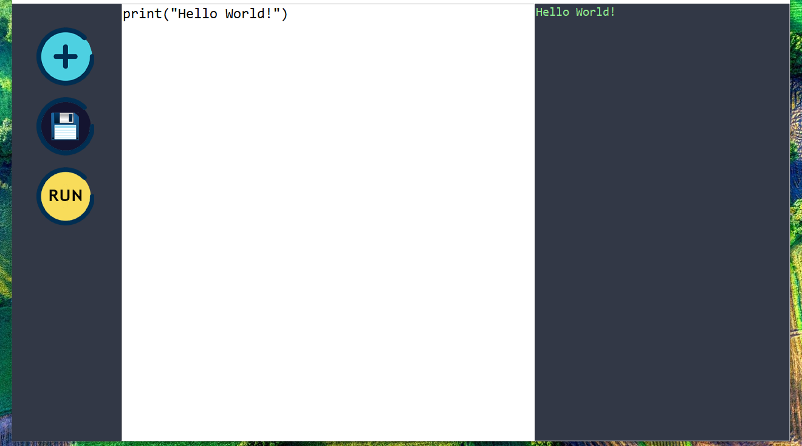

# 🐍 Python IDLE Clone (Python + Tkinter GUI)

A minimalist and functional Python code editor and runner built using Python's `tkinter`. This application allows users to write, open, save, and execute Python code within a clean, dark-themed GUI.

---

## 📌 Features

- 📂 **Open File**: Load existing `.py` files into the editor.
- 💾 **Save File**: Save or overwrite Python scripts with ease.
- ▶️ **Run Code**: Execute the current Python script and display the output or errors.
- 📋 **Output Panel**: Displays standard output and errors for debugging.
- 🎨 **Custom GUI**: Dark-themed interface with modern icons.

---

## 📂 Project Structure

`29_Python_Custom_IDLE/`  
├── assets/  
│   ├── logo.png  
│   ├── open.png  
│   ├── save.png
│   ├── screenshot.png  
│   └── run.png  
├── main.py  
├── IDLE_trial_code.py  
├── requirements.txt  
└── README.md  

---

## ▶️ How to Run

1. **Install Python 3.7 or higher**
2. **(Optional)** Install dependencies:

```bash
pip install -r requirements.txt

```
3. **Run the application:**

```bash
python main.py
```

---

## ⚙️ How It Works

1. Tkinter GUI Setup
    - Creates a fixed-size, non-resizable window with a dark background and text areas for code and output.
2. Code Editor & Output
    - The left pane is for writing code.
    - The right pane shows output or errors after running the script.
3. Open & Save Files
    - File dialogs are used to open .py files and save code changes.
4. Run Script
    - The script is saved temporarily and executed using subprocess, capturing both output and error streams.

---

## 📦 Dependencies

- Python 3.7 or higher
- `tkinter` – built-in Python GUI module

---

## 📸 Screenshot



---

## 📚 What You Learn

- GUI development using tkinter
- File dialogs (askopenfilename, asksaveasfilename)
- Handling text widgets and multi-line input
- Running subprocesses in Python
- Building simple developer tools with Python

---

## 👤 Author

Made with ❤️ by **Shahid Hasan**  
Feel free to connect and collaborate!

---

## 📄 License

This project is licensed under the MIT License – free to use, modify, and distribute.