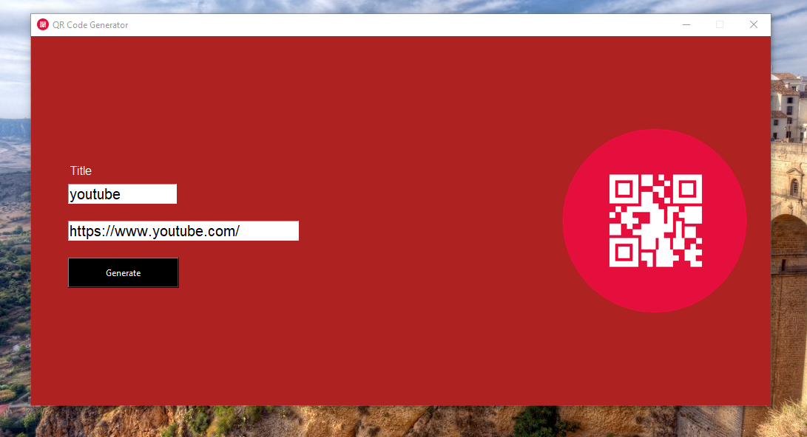

# 🔳 QR Code Generator (Python + Tkinter GUI)

A sleek and simple QR code generator built with Python's Tkinter library and the qrcode module. Users can enter any text or link, give it a title, and instantly generate and save a QR code image to their system.

---

## 📌 Features

- 🧾 Text to QR conversion: Enter any text, URL, or data to generate a QR code.
- 💾 Auto Save: Automatically saves the QR image to a folder named `Qrcode`, using the title as the file name.
- 🖼️ Logo Display: Includes a display image/logo on the interface.
- 🎨 User-Friendly GUI: Clean layout with entry fields and a single-click button to generate.

---

## 📂 Project Structure

22_QR_Code_Generator/  
├── assets/  
│   ├── icon.ico 
│   ├── icon_32.png
│   ├── screenshot.png 
│   └── icon.png  
├── Qrcode/  
│   └── (Generated QR images will be saved here)  
├── main.py  
├── requirements.txt  
└── README.md  

---

## ▶️ How to Run

1. **Install Python 3.7+** (make sure it's added to PATH).  
2. **Install dependencies:**

```bash
pip install -r requirements.txt
```
3. **Run the application:**

```bash
python main.py
```

---

## ⚙️ How It Works

1. Tkinter GUI Initialization
2. User Input
    - Title (used as filename)
    - Text/Link (data for the QR code)
3. QR Code Generation
    - The qrcode module creates a PNG image
    - Saved to the Qrcode folder with the provided title
4. GUI Includes:
    - A custom icon (icon.ico) in the title bar
    - An image (icon.png) shown in the right panel

---

## 📦 Dependencies

- Python 3.7 or higher
- Tkinter (pre-installed with Python)
- qrcode
- Pillow (for image processing with ImageTk)

---

## 📸 Screenshot



---

## 📚 What You Learn

- Building GUI apps using Tkinter
- Working with QR code generation in Python
- File and folder management with os
- Using external libraries like Pillow and qrcode

---

## 👤 Author

Made with ❤️ by **Shahid Hasan**  
Feel free to connect and collaborate!

---

## 📄 License

This project is licensed under the MIT License – free to use, modify, and distribute.