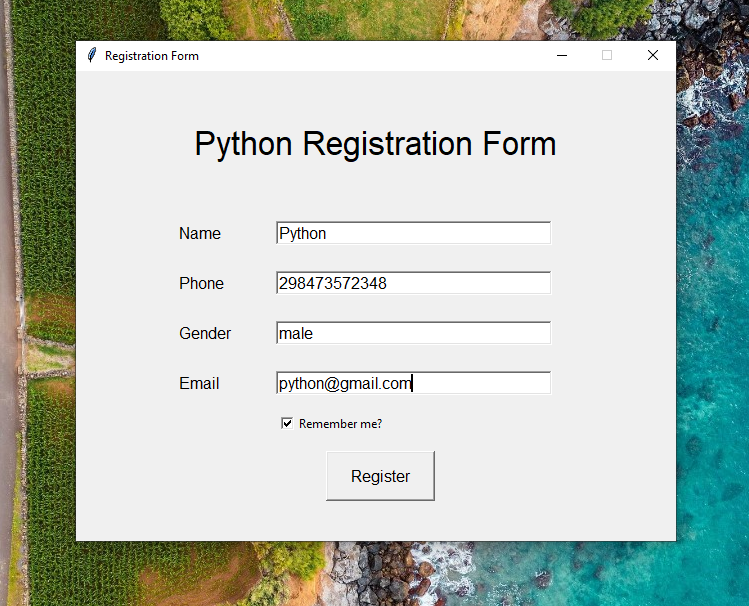

# 📝 Registration Form with File Reader (Python + Tkinter GUI)

A complete registration system with file reading capability that saves and retrieves user data.
---

## 📌 Features

- ✏️ User registration form (Name, Phone, Gender, Email)
- 💾 Save registrations to text files
- 📖 Read saved registrations with file browser
- 🗂️ Organized file management
- 🛡️ Built-in error handling
- 🎯 Clean data presentation
- 🔍 File type filtering (.txt)

---

## 📂 Project Structure
```
Registration_Form_GUI/
├── assets/
│   └── screenshot.png          
├── main.py        
├── requirements.txt      
└── README.md             
```
---

## ▶️ How to Run

1. Ensure Python 3.10 is installed
2. Run the application:

```bash
python main.py
```
---

## How it works:

1. Registration:
    - Fill in the form fields
    - Click "Register" to save data to a text file
    - Automatic field clearing after submission
2. Reading Data:
    - Click "Read File" to open file browser
    - Select any registration .txt file
    - View formatted registration details in popup window

---

## 📦 Dependencies
- Python 3.10 (includes Tkinter)
- No additional packages required

---

## 📸 Screenshot



---

## 📚 What You Learn

- Tkinter GUI development
- File handling operations
- Dialog boxes (file open/save)
- Data persistence
- Error handling
- Clean UI design principles

---

## 👤 Author

Made with ❤️ by **Shahid Hasan**  
Feel free to connect and collaborate!

---

## 📄 License

This project is licensed under the MIT License – free to use, modify, and distribute.