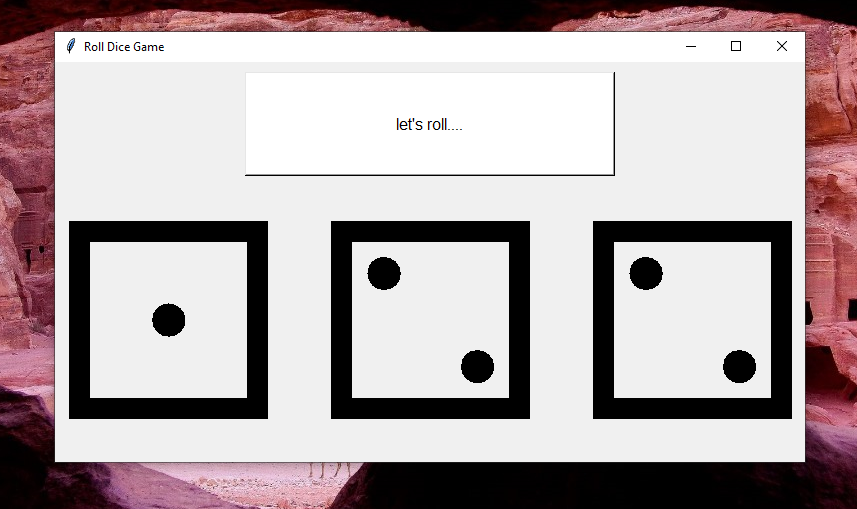

# 🎲 Roll Dice Game (Python + Tkinter GUI)

A fun and simple dice-rolling game built using Python's Tkinter library. With every click of the "Let's roll..." button, three random dice faces are displayed using Unicode characters—bringing the randomness of a real dice game to your desktop.

---

## 📌 Features

- 🎲 Triple Dice Roll: Simulates rolling three dice at once with real Unicode die faces.
- 🖱️ Single Click Operation: Just hit the button to roll all dice.
- 🎨 Clean UI: Large fonts, centralized layout, and responsive display.
- 🧪 Random Outcomes: Every click results in a different combination using Python’s random module.

---

## 📂 Project Structure
```
Roll_Dice_Game/  
├── assets/
│   └── screenshot.png
├── main.py   
└── README.md  
```
---

## ▶️ How to Run

1. **Install Python 3.7+** (make sure it's added to PATH).  
2. **Run the application:**

```bash
python main.py
```

---

## ⚙️ How It Works

1. Tkinter Window Initialization
2. Dice List Setup with Unicode die symbols (⚀ to ⚅)
3. Randomly selects three die faces using random.choice() and displays them together.
4. Dynamic Update of the dice on the GUI

---

## 📦 Dependencies

- **Python** 3.7 or higher
- **Tkinter** (pre-installed with most Python distributions; may require manual install on Linux)
- **random** (Python standard library)

---

## 📸 Screenshot



---

## 📚 What You Learn

- GUI development with Tkinter
- Unicode symbol handling
- Randomization in Python
- Designing interactive desktop applications

---

## 👤 Author

Made with ❤️ by **Shahid Hasan**  
Feel free to connect and collaborate!

---

## 📄 License

This project is licensed under the MIT License – free to use, modify, and distribute.