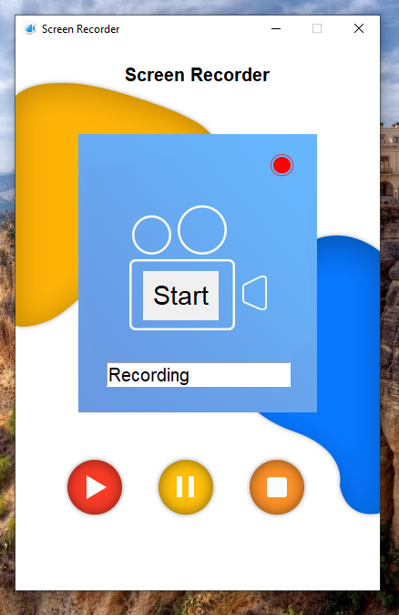

# 🎥 Screen Recorder (Python + Tkinter GUI)

A professional screen recording application built with Python’s Tkinter library and the `pyscreenrec` module. This tool allows you to start, pause, resume, and stop screen recordings with an elegant graphical interface.

---

## 📌 Features

- 🔴 **Start Recording**: Capture your screen in `.mp4` format with a single click.
- ⏸️ **Pause/Resume**: Flexibly pause and resume screen recordings.
- ⏹️ **Stop and Save**: Automatically saves recordings with a custom filename.
- 🗂️ **Auto Directory Management**: Recordings are saved in a `recordings/` folder for better organization.
- 🖼️ **Custom GUI**: Includes beautiful themed background images and icons for better visual experience.
- 🧾 **Filename Input**: Users can easily define the output filename before the recording starts.

---

## 📂 Project Structure
```
`Screen_Recorder_GUI/`  
├── assets/  
│   ├── icon.png  
│   ├── yellow.png  
│   ├── blue.png  
│   ├── recording.png  
│   ├── pause.png  
│   ├── resume.png 
│   ├── screenshot.png  
│   └── stop.png  
├── recordings/ *(auto-generated on first run)*  
├── main.py  
├── requirements.txt  
└── README.md  
```
---

## ▶️ How to Run

1. **Install Python 3.7 or higher** (make sure Python is added to PATH).  
2. **Install dependencies** by running:

```bash
pip install -r requirements.txt
```
3. **Run the application:**

```bash
python main.py
```

---

## ⚙️ How It Works

1. Tkinter GUI Setup
    - A fixed-size, responsive GUI window is initialized using Tkinter.
2. Asset Management
    - Background and button icons are loaded from an `assets/` folder using `PhotoImage`.
3. Recording Logic
    - Uses the `pyscreenrec` module to record the screen at a defined frame rate.
    - Output is saved in the `recordings/` folder with a custom filename.
4. Control Buttons
    - **Start**: Begins recording with the given filename.
    - **Pause/Resume**: Toggles the recording state.
    - **Stop**: Stops and finalizes the video file.

---

## 📦 Dependencies

- Python 3.7 or higher
- `pyscreenrec` – for screen capturing
- `tkinter` – built-in Python GUI module

---

## 📸 Screenshot



---

## 📚 What You Learn

- GUI application design with Tkinter
- Managing screen recordings using Python
- Handling user input and output paths
- Dynamic file and folder creation with os.path
- Integrating visual assets in Python apps

---

## 👤 Author

Made with ❤️ by **Shahid Hasan**  
Feel free to connect and collaborate!

---

## 📄 License


This project is licensed under the MIT License – free to use, modify, and distribute.
