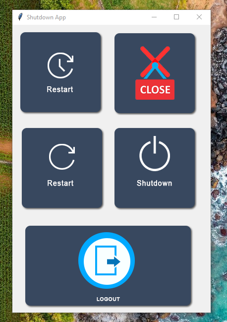

# 🖥️ Shutdown App (Python + Tkinter GUI)

A simple yet effective system control app built with Python's Tkinter library. It provides GUI-based access to core Windows power options like shutdown, restart (immediate & delayed), and logout using a sleek button interface.

---

## 📌 Features

- 🔄 **Restart in 30 Seconds**: Schedule a system restart after 30 seconds.
- ⏻ **Immediate Restart**: Restart the system instantly.
- ⛔ **Shutdown**: Instantly shuts down the computer.
- 🚪 **Logout**: Logs the user out of the current session.
- ❌ **App Exit**: Close the application via GUI.
- 🎨 **Button-Based Interface**: Clean, button-driven design using custom icons.

---

## 📂 Project Structure
```
Shutdown_App_GUI/
├── assets/  
│   ├── restart_time.png  
│   ├── restart.png
│   ├── screenshot.png  
│   ├── shutdown.png  
│   ├── logout.png  
│   └── close.png  
├── main.py  
├── requirements.txt  
└── README.md  
```
---

## ▶️ How to Run

1. Ensure Python 3.10 is installed.
2. Place all images in the `assets/` folder.
3. Run the application:

```bash
python main.py
```
---

## ⚙️ How it works

1. Restart Timer
    - Click the "Restart in 30s" button to schedule a system restart after 30 seconds.
2. Immediate Actions
    - Shutdown, restart, or logout instantly via dedicated buttons.
3. App Control
    - The close button exits the GUI window.

---

## 📦 Dependencies

- Python 3.10 (Tkinter is included with standard Python distributions)
- No additional packages required

---

## 📸 Screenshot



---

## 📚 What You Learn

- Tkinter-based GUI development
- Button widgets with image integration
- Using os.system for executing system commands
- Project structuring and asset management
- User-focused interface design

---

## 👤 Author

Made with ❤️ by **Shahid Hasan**  
Feel free to connect and collaborate!

---

## 📄 License


This project is licensed under the MIT License – free to use, modify, and distribute.
