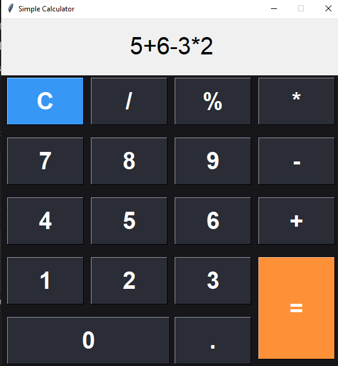

# 🧮 Simple Calculator (Python + Tkinter GUI)

A clean, modern calculator application with a dark theme interface. Built with Python's Tkinter, this calculator handles basic arithmetic operations including percentage calculations with an intuitive UI.

---

## 📌 Features

- ➕ **Basic Operations**: Addition, subtraction, multiplication, division
- % **Percentage Calculations**: Handles both standalone percentages (50% → 0.5) and percentage of values (50%200 → 100)
- 🆑 **Clear Function**: Single button to reset calculations
- 🎨 **Modern UI**: Dark theme with color-coded buttons
- 📱 **Responsive Design**: Fixed size (570×600) optimized for calculator use

---

## 📂 Project Structure
```
`Simple_Calculator_GUI/`  
├── assets/  
│   └── screenshot.png
├── main.py  
└── README.md  
```
---

## ▶️ How to Run

1. **Install Python 3.10**
2. **Run the application:**

```bash
python main.py
```

---

## ⚙️ How It Works

1. Input Handling
    - Click buttons to build your calculation
    - Operations are displayed in real-time
    - Supports chained operations (e.g., 5+5×2)
2. Special Functions
    - `C` button clears all inputs
    - `=` evaluates the expression
    - `%` handles percentage calculations in two ways:
       - Converts standalone percentages to decimals (50% → 0.5)
       - Calculates percentage of following number (50%200 → 100)
3. Error Handling
    - Catches invalid expressions and displays "Error"
    - Automatically resets after errors

---

## 📸 Screenshot



---

## 📚 What You Learn

- GUI development with Tkinter
- Event-driven programming
- Mathematical expression evaluation
- String manipulation for percentage handling
- Error handling in mathematical operations
- UI layout and design principles

---

## 👤 Author

Made with ❤️ by **Shahid Hasan**  
Feel free to connect and collaborate!

---

## 📄 License


This project is licensed under the MIT License – free to use, modify, and distribute.

