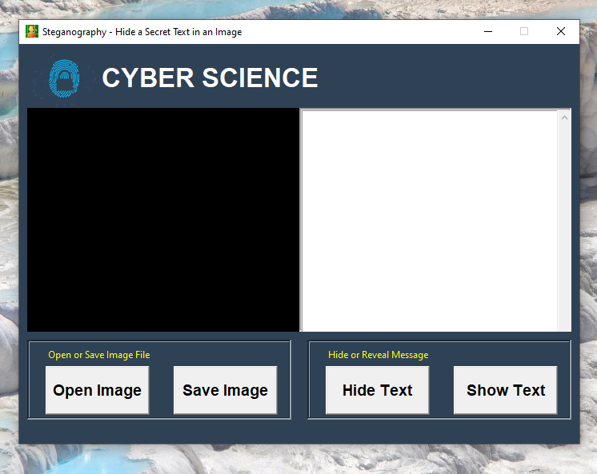

# 🔐 Steganography App (Python + Tkinter GUI)

A beginner-friendly and visually styled Python GUI app that hides secret messages inside images using **Steganography** (LSB method). Built using `tkinter`, `Pillow`, and `stegano`, this app supports `.png` and `.jpg` images with a clean, fixed layout design.

---

## 📌 Features

- 🖼️ **Open Image**: Load any PNG or JPG image into the GUI.
- 🔏 **Hide Text**: Secret messages are embedded invisibly into the image using LSB steganography.
- 🧾 **Reveal Text**: Extract and display hidden text from any compatible image.
- 💾 **Save Image**: Save the modified image with embedded text as a new `.png` file.
- 🎨 **Custom GUI**: Modern dark-themed UI with clear structure and user-friendly controls.

---

## 📂 Project Structure

`30_Steganography_Hide_Text_In_Image/`  
├── assets/  
│   ├── logo.png
│   ├── screenshot.png  
│   └── logo.jpg  
├── main.py  
├── requirements.txt 
├── hidden.png
└── README.md  

---

## ▶️ How to Run

1. **Install Python 3.7 or higher**
2. **Install dependencies:**

```bash
pip install -r requirements.txt

```
3. **Run the application:**

```bash
python main.py
```

---

## ⚙️ How It Works

1. GUI Setup
    - Fixed-size `Tkinter` window with two panes and control frames.
2. Image Processing
    - Uses `Pillow` to display the selected image.
3. Text Hiding (LSB)
    - Secret message is embedded pixel by pixel using the `stegano` library’s LSB method.
4. Text Revealing
    - Reads the hidden text from image pixels and shows it in the text box.
5. Save Image
    - Prompts user to save the image with the embedded message as a `.png`.

---

## 📦 Dependencies

- `Pillow` – image loading and processing
- `stegano` – steganography hiding and revealing
- `tkinter` – Python’s standard GUI toolkit

---

## 📸 Screenshot



---

## 📚 What You Learn

- GUI programming with `tkinter`
- Handling images with `Pillow`
- Basic Steganography using the `stegano` package
- Text and file dialogs in GUI
- Saving and opening image files in real projects

---

## 👤 Author

Made with ❤️ by **Shahid Hasan**  
Feel free to connect and collaborate!

---

## 📄 License

This project is licensed under the MIT License – free to use, modify, and distribute.