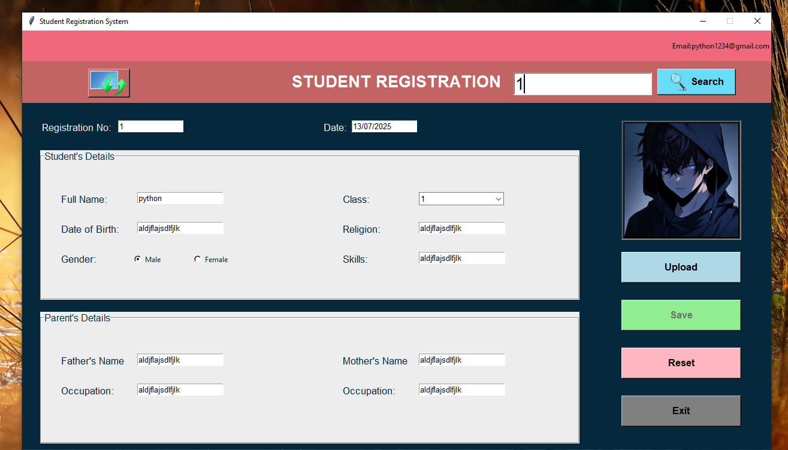

# ✅ Student Registration System (Python + Tkinter GUI)

A beginner-friendly and fully functional Python GUI application for managing **student registrations**. Built using `tkinter`, `Pillow`, and `openpyxl`, this app allows you to **add, search, update, reset, and store student data** in an Excel sheet and save their photo profiles locally.

---

## 📌 Features

- 📝 **Add New Students**: Input and save full student details along with a profile picture.
- 🔍 **Search Students**: Search and auto-fill student records using their registration number.
- ✏️ **Update Records**: Edit existing student information and update the Excel file.
- 🧹 **Reset Form**: Clear all fields and image preview with one click.
- 💾 **Excel Storage**: Saves all data into an Excel file (`Student_data.xlsx`) for persistence.
- 🖼️ **Image Upload**: Upload and store student profile photos in a dedicated folder.
- 📅 **Auto Date & Registration No.**: Automatically generates registration numbers and current date.

---

## 📂 Project Structure

`41_Excel_Datasheet_Viewer/`  
├── assets/
│ ├── Images/
│ │ ├── Layer 4.png
│ │ ├── logo.png
│ │ ├── upload photo.png
│ │ └── search.png
│ └── Student Images/
│   └── 1.jpg
├── Student_data.xlsx
├── main.py
├── requirements.txt
└── README.md

---

## ▶️ How to Run

1. **Install Python 3.7 or higher**
2. **Install dependencies:**

```bash
pip install -r requirements.txt
```
3. **Run the application:**

```bash
python main.py
```

---

## ⚙️ How It Works

1. Student Entry
    - User enters student and parent information into a user-friendly form.
2. Image Upload
    - Clicking Upload allows selection of a `.jpg` or `.png` photo, which is resized and previewed.
3. Save to Excel
    - Data is saved into `Student_data.xlsx` using `openpyxl`, including registration date and gender.
4. Search and Update
    - Search using registration number. Fields are auto-filled for updating and saving again.
5. Persistent Image Storage
    - Profile pictures are saved as `{reg_no}.jpg` in `assets/Student Images/`.

---

## 📦 Dependencies

- `Pillow` – for image handling (resizing, saving)
- `openpyxl` – for reading and writing Excel files
- `tkinter` – GUI creation (built-in)

---

## 📸 Screenshot



---

## 📚 What You Learn

- GUI creation with `tkinter`
- Working with Excel files using `openpyxl`
- Image handling with `Pillow`
- Event-driven programming (button actions, input handling)
- Organizing a multi-component Python project

---

## 👤 Author

Made with ❤️ by **Shahid Hasan**  
Feel free to connect and collaborate!

---

## 📄 License

This project is licensed under the MIT License – free to use, modify, and distribute.