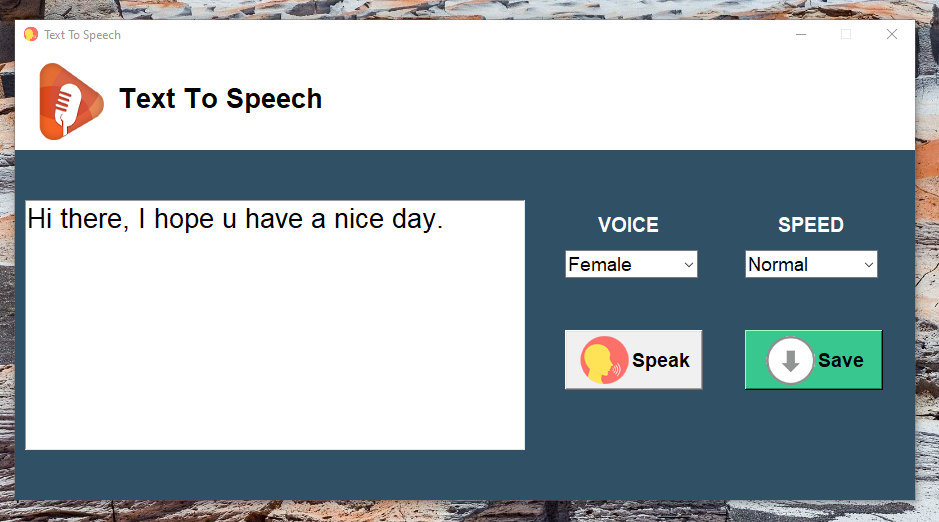

# 🗣️ Text To Speech App (Python + Tkinter GUI)

A professional text-to-speech (TTS) application built using Python's `tkinter` and `pyttsx3`. This interactive GUI allows users to convert typed text into spoken words with adjustable voice and speech speed, and also save it as an audio file.

---

## 📌 Features

- 📝 **Text Input**: Type or paste any text into the editor.
- 🔊 **Speech Output**: Hear your typed content in a natural-sounding voice.
- 🗣️ **Voice Selection**: Choose between Male and Female voices.
- 🐢🐇 **Speed Control**: Adjust speech rate — Slow, Normal, or Fast.
- 💾 **Save to MP3**: Download the spoken text as an `.mp3` file.
- 🎨 **Custom GUI**: Beautiful layout with icons and branding.

---

## 📂 Project Structure

`27_Text_To_Speech/`  
├── assets/  
│   ├── speak.png  
│   ├── download.png 
│   ├── screenshot.png  
│   └── speaker logo.png  
├── main.py  
├── requirements.txt  
├── text.mp3  
└── README.md  

---

## ▶️ How to Run

1. **Install Python 3.7 or higher**  
2. **Install dependencies** by running:

```bash
pip install -r requirements.txt
```
3. **Run the application:**

```bash
python main.py
```

---

## ⚙️ How It Works

1. Tkinter GUI Setup
    - A fixed-size, responsive GUI window is initialized using Tkinter.
2. Voice Configuration
    - Uses `pyttsx3` to access system voices and set gender + speed.
3. Speech Playback
    - Reads the typed text aloud on button click.
4. Save Functionality
    - Asks user to choose a folder and saves the spoken text as `text.mp3`.

---

## 📦 Dependencies

- Python 3.7 or higher
- `pyttsx3` – for speech synthesis
- `tkinter` – built-in Python GUI module

---

## 📸 Screenshot



---

## 📚 What You Learn

- GUI development with Tkinter
- Text-to-speech conversion with Python
- Voice customization with `pyttsx3`
- File I/O with directory prompts
- Asset integration in Python applications

---

## 👤 Author

Made with ❤️ by **Shahid Hasan**  
Feel free to connect and collaborate!

---

## 📄 License

This project is licensed under the MIT License – free to use, modify, and distribute.