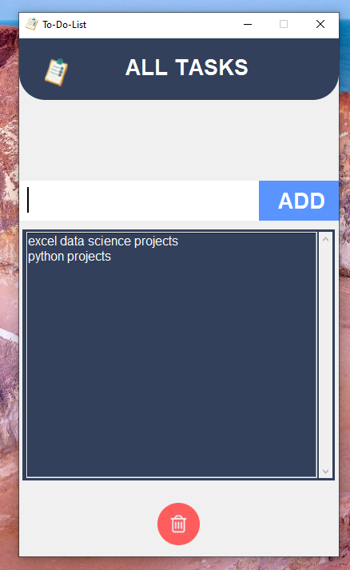

# ✅ To-Do List App (Python + Tkinter GUI)

A beginner-friendly and visually styled Python GUI app that allows you to **add, view, and delete daily tasks** using a simple interface. Built using `tkinter`, `Pillow`, and Python’s file handling, the app supports saving your tasks to a `.txt` file and displays them in a clean, scrollable list.

---

## 📌 Features

- ➕ **Add Tasks**: Write a task and add it to your to-do list with a single click.
- 🗑️ **Delete Tasks**: Select any task and remove it from the list and file.
- 💾 **Persistent Storage**: Saves your tasks in a `.txt` file so they’re available the next time you open the app.
- 🖼️ **Custom GUI**: Clean layout with custom icons and images.
- 📋 **Auto Load Tasks**: Automatically loads all saved tasks when the app starts.

---

## 📂 Project Structure

`35_ToDo_List_App/`  
├── assets/  
│   ├── topbar.png  
│   ├── dock.png  
│   ├── task.png  
│   └── delete.png  
├── tasklist.txt  
├── main.py  
├── requirements.txt  
└── README.md  

---

## ▶️ How to Run

1. **Install Python 3.7 or higher**
2. **Install dependencies:**

```bash
pip install -r requirements.txt
```
3. **Run the application:**

```bash
python main.py
```

---

## ⚙️ How It Works

1. GUI Setup
    - Uses `tkinter` to create a simple, fixed-size layout with image styling.
2. Task Addition
    - Gets input from the user, saves it to a file, and updates the GUI list.
3. Task Deletion
    - Removes the selected task from both the GUI and the `tasklist.txt` file.
4. Auto Load
    - On startup, the app reads all existing tasks from `tasklist.txt` and loads them into the list.

---

## 📦 Dependencies

- `Pillow` – for displaying `.png` icons and backgrounds
- `tkinter` – GUI creation (built-in)

---

## 📸 Screenshot



---

## 📚 What You Learn

- GUI programming with `tkinter`
- Persistent storage using Python’s file handling
- Event-driven programming with buttons and listbox
- Customizing interfaces with images and icons
- Organizing Python GUI projects

---

## 👤 Author

Made with ❤️ by **Shahid Hasan**  
Feel free to connect and collaborate!

---

## 📄 License

This project is licensed under the MIT License – free to use, modify, and distribute.