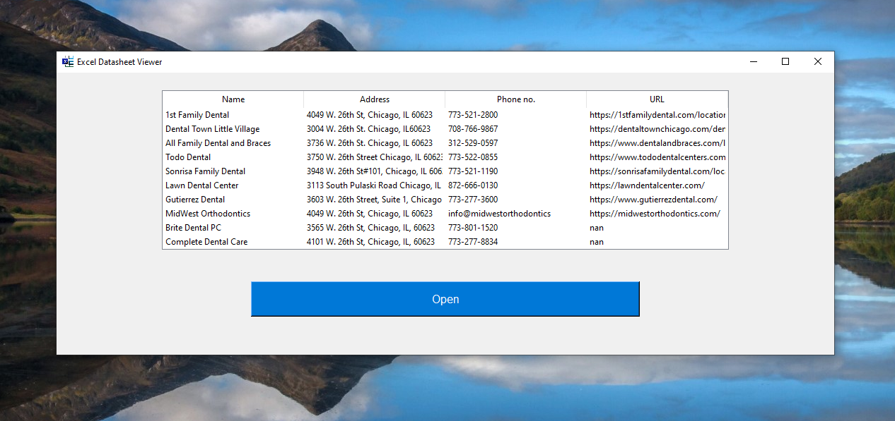

# ✅📊🧾 Excel Datasheet Viewer App (Python + Tkinter GUI)

A beginner-friendly Python GUI application to **open and view Excel `.xlsx` datasheets** in a scrollable table format using `tkinter`, `pandas`, and `ttk.Treeview`. This app allows users to visually browse Excel data in a clean and simple interface.

---

## 📌 Features

- 📂 **Open Excel Files**: Browse and load `.xlsx` files with one click.
- 📊 **Treeview Display**: Renders Excel data as a scrollable table using `ttk.Treeview`.
- 🧹 **Auto-Clears Old Data**: Automatically removes previously loaded content when a new file is opened.
- ⚠️ **Error Handling**: Alerts user if file is unreadable or corrupt.
- 🖼️ **Custom Icon**: Uses a custom app icon (`logo.png`) from the `assets` folder.

---

## 📂 Project Structure

`40_Excel_Datasheet_Viewer/`  
├── assets/  
│   ├── screenshot.png
│   └── logo.png  
├── main.py  
├── requirements.txt  
└── README.md  

---

## ▶️ How to Run

1. **Install Python 3.7 or higher**
2. **Install dependencies:**

```bash
pip install -r requirements.txt
```
3. **Run the application:**

```bash
python main.py
```

---

## ⚙️ How It Works

1. GUI Layout
    - Designed using `tkinter` with a button and `Treeview` table layout.
2. File Selection
    - Uses `filedialog.askopenfilename()` to choose an Excel file from disk.
3. Excel Reading
    - Loads Excel data using `pandas.read_excel()` and converts it to rows using `NumPy`.
4. Table Population
    - Clears any previous content, then populates the `Treeview` with new data and column headers.
5. Error Handling
    - Catches and alerts the user if the file fails to open or is not in the correct format.

---

## 📦 Dependencies

- `pandas` – for reading Excel files
- `numpy` – for converting DataFrame to list
- `tkinter` – GUI creation (built-in)

---

## 📸 Screenshot



---

## 📚 What You Learn

- GUI creation with `tkinter`
- Reading and displaying Excel data using `pandas` and `Treeview`
- File dialog integration
- Error handling in GUI apps
- Structuring Python GUI projects

---

## 👤 Author

Made with ❤️ by **Shahid Hasan**  
Feel free to connect and collaborate!

---

## 📄 License

This project is licensed under the MIT License – free to use, modify, and distribute.