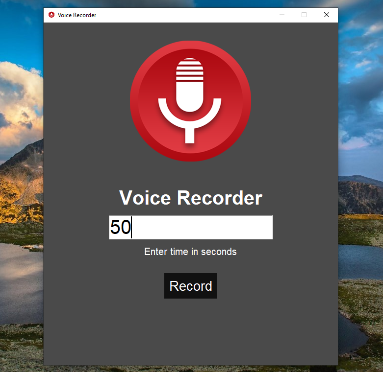

# 🎤 Voice Recorder App (Python + Tkinter GUI)

A simple yet functional voice recording application that allows you to **record audio for a specified duration** and save it as a WAV file. Built using `tkinter`, `sounddevice`, and `scipy`, this app provides a clean interface with a countdown timer and automatic saving of recordings.

---

## 📌 Features

- ⏺️ **Record Audio**: Capture high-quality audio (44100 Hz sample rate, stereo) for any duration.
- ⏱️ **Timer Countdown**: Visual countdown showing remaining recording time.
- 💾 **Auto-Save**: Recordings are automatically saved as `recording.wav` in the project directory.
- 🖼️ **Custom GUI**: Clean dark-themed interface with custom icons.
- 📁 **Path Display**: Shows the exact save location after recording completes.

---

## 📂 Project Structure
```
`Voice_Recorder/`  
├── assets/  
│   └── Record.png  
├── main.py  
├── requirements.txt  
└── README.md  
```
---

## ▶️ How to Run

1. **Install Python 3.10**
2. **Install dependencies:**

```bash
pip install -r requirements.txt
```
3. ** Run the application:**
```bash
python main.py
```
---
## ⚙️ How It Works

1. GUI Setup
    - Uses `tkinter` to create a 600x700 fixed-size window with dark theme
2. Audio Recording
    - Uses `sounddevice` to capture audio at 44.1kHz stereo quality
3. Timer System
    - Counts down the specified seconds while recording
    - Shows completion alert when time elapses
4. File Saving
    - Uses `scipy.io.wavfile.write` to save recording as WAV file

---

## 📦 Dependencies

- `sounddevice` – Audio recording functionality
- `scipy` – WAV file writing capability
- `tkinter` – GUI creation (built-in)

---

## 📸 Screenshot



---
## 📚 What You Learn

- Audio recording with Python
- GUI programming with tkinter
- Working with WAV files in Python
- Timer/countdown implementations
- File path handling with os module

---

## 👤 Author

Made with ❤️ by **Shahid Hasan**  
Feel free to connect and collaborate!

---

## 📄 License


This project is licensed under the MIT License – free to use, modify, and distribute.
