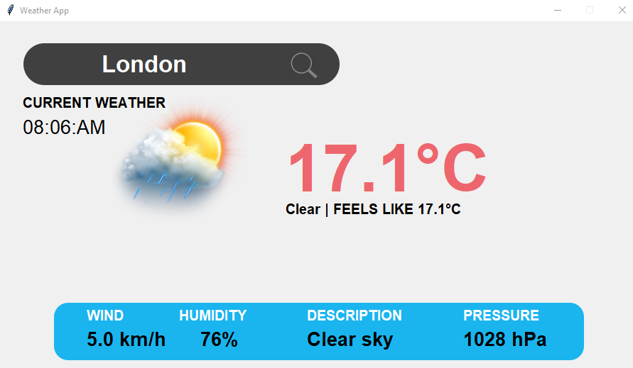

# 🌦️ Weather Forecast App (Python + Tkinter GUI)

A modern weather application that provides real-time weather data for any city worldwide. Features include temperature, humidity, wind speed, atmospheric pressure, and local time display, all presented in a clean graphical interface.

---

## 📌 Features

- 🌍 **Global City Search**: Get weather data for any city worldwide
- 🕒 **Local Time Display**: Shows current time in the searched location
- 📊 **Comprehensive Metrics**: Temperature, humidity, wind speed, pressure, and weather conditions
- 🖼️ **Visual Interface**: Clean GUI with custom graphics and icons
- ⚡ **Real-time Data**: Fetches live weather data from OpenWeatherMap API

---

## 📂 Project Structure

`WeatherForecast_GUI/`  
├── assets/  
│   ├── search.png  
│   ├── screenshot.png  
│   ├── search_icon.png  
│   ├── logo.png  
│   └── box.png  
├── main.py  
├── requirements.txt  
└── README.md  

---

## ▶️ How to Run

1. **Install Python 3.10**
2. **Install dependencies:**

```bash
pip install -r requirements.txt
```
4. Run the app using:

```bash
python main.py
```
---

## ⚙️ How It Works

1. City Input
    - User enters a city name in the search field
    - Application geolocates the city using Nominatim
2. Data Fetching
    - Retrieves timezone information using TimezoneFinder
    - Fetches weather data from OpenWeatherMap API
    - Calculates local time using pytz
3. Display
    - Presents weather information in an organized layout
    - Shows temperature, wind speed (converted to km/h), humidity, pressure, and weather description
    - Displays current local time of the searched location

---

## 📦 Dependencies

- `geopy` - For city geolocation
- `timezonefinder` - For determining timezones from coordinates
- `pytz` - For timezone calculations
- `requests` - For API communication
- `tkinter` - GUI framework (built-in)

---

## 🔧 Configuration

The app uses OpenWeatherMap API with a default API key. For production use:
1. Get your own API key from OpenWeatherMap
2. Replace the API key in the code:
```python
api = f"https://api.openweathermap.org/data/2.5/weather?q={city}&appid=YOUR_API_KEY&units=metric"
```

---
## 📸 Screenshot


---

## 📚 What You Learn

- Working with geolocation APIs
- Timezone calculations
- API integration and JSON data parsing
- Building responsive GUI applications
- Error handling in API requests
- Creating visually appealing interfaces

---

## 👤 Author

Made with ❤️ by **Shahid Hasan**  
Weather data provided by OpenWeatherMap

---

## 📄 License


This project is licensed under the MIT License – free to use, modify, and distribute.
