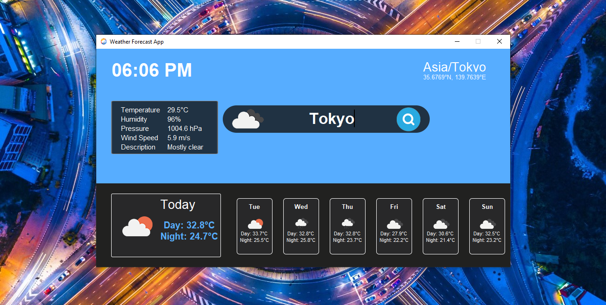

# 🌦️ Weather Forecast App (Python + Tkinter GUI)

A beginner-friendly and visually styled Python GUI app that shows **real-time weather**, **7-day forecast**, and **local time** based on your searched city. Built using `tkinter`, `Pillow`, `geopy`, `timezonefinder`, and `requests`, this app delivers live weather data with detailed visuals and location-specific information.

---

## 📌 Features

- 🔍 **City Search**: Enter any city name to view its current weather and forecast.
- 🌡️ **Weather Details**: See temperature, humidity, pressure, wind speed, and weather description.
- 🕓 **Local Time & Timezone**: Automatically shows the local time and timezone of the city.
- 🌄 **Sunrise & Sunset Times**: Displays sunrise and sunset based on your location.
- 📅 **7-Day Forecast**: Shows icons and temperatures for upcoming days with dynamic image loading.
- 🖼️ **Custom GUI**: Clean, themed layout using background and icon images.
- 📡 **Error Handling**: Informs the user about internet issues or invalid city input.

---

## 📂 Project Structure

`37_Weather_Forecast_App/`  
├── assets/  
│   ├── screenshot.png
│   ├── Images/  
│   │   ├── logo.png  
│   │   ├── Layer 6.png  
│   │   ├── Layer 7.png  
│   │   ├── Rounded Rectangle 1.png  
│   │   ├── Rounded Rectangle 2.png  
│   │   └── Rounded Rectangle 3.png  
│   └── icon/  
│       ├── 01d@2x.png  
│       ├── 01n@2x.png  
│       ├── ... (weather icons)  
├── main.py  
├── requirements.txt  
└── README.md  

---

## ▶️ How to Run

1. **Install Python 3.7 or higher**
2. **Install dependencies:**

```bash
pip install -r requirements.txt
```
3. **Run the application:**

```bash
python main.py
```

---

## ⚙️ How It Works

1. City Input & Geolocation
    - Uses `geopy` and `timezonefinder` to get latitude, longitude, and local timezone of a city.
2. Weather API Integration
    - Fetches current weather and forecast data from Open-Meteo API.
3. Dynamic GUI Update
    - Displays updated temperature, icons, sunrise/sunset, and forecast in a custom layout.
4. Local Time Display
    - Uses `pytz` and timezone info to show accurate local time for the searched city.

---

## 📦 Dependencies

- `geopy` – for geolocation
- `timezonefinder` – for timezone detection
- `requests` – for fetching weather data
- `pytz` – for time conversion
- `Pillow` – for displaying `.png` icons and images
- `tkinter` – for GUI (built-in)

---

## 📸 Screenshot



---

## 📚 What You Learn

- Real-time API integration
- GUI programming with `tkinter`
- Timezone and geolocation-based data usage
- Error handling with retries and user feedback
- Custom image-based GUI layout

---

## 👤 Author

Made with ❤️ by **Shahid Hasan**  
Feel free to connect and collaborate!

---

## 📄 License

This project is licensed under the MIT License – free to use, modify, and distribute.